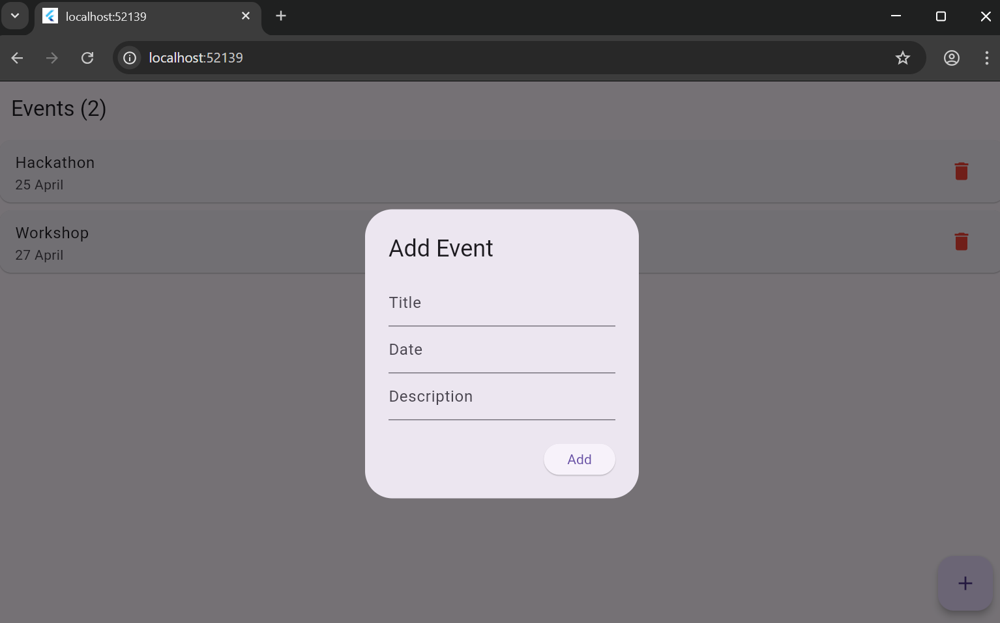
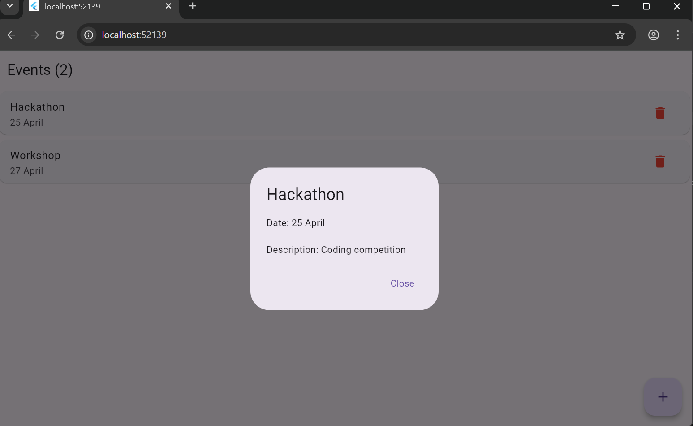
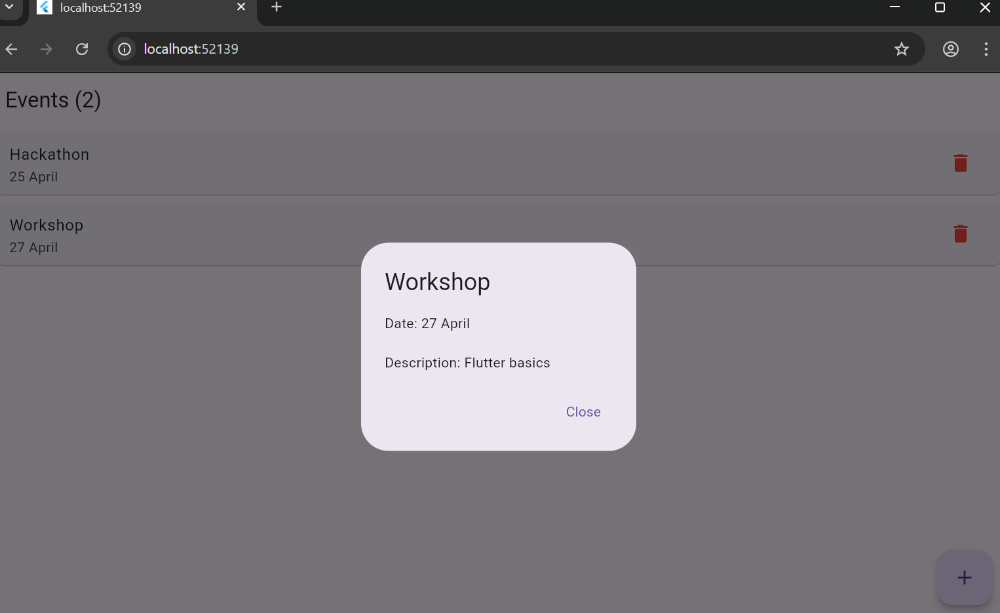

# Campus Event Manager App

## Project Overview
The Campus Event Manager App is a simple mobile application developed using Flutter and Dart.  
It allows users to view, add, and manage campus events such as workshops, seminars, and hackathons.

This project demonstrates basic Flutter concepts including UI design, state management, and handling user input.

---

## Objectives
- To understand Flutter app structure and widget tree  
- To implement state management using StatefulWidget  
- To manage data using Dart Lists and classes  
- To build a simple and responsive user interface  

---

## Features
- Display list of upcoming events  
- Add new event using input form  
- Delete event from the list  
- View event details (title, date, description)  
- Display total number of events  

---

## Technologies Used
- Flutter Framework  
- Dart Programming Language  

---

## Project Structure

campus_event_app/
│
├── lib/
│ └── main.dart
├── android/
├── ios/
├── pubspec.yaml
├── README.md

---

## How to Run the Project

1. Install Flutter SDK  
2. Open the project in VS Code  
3. Run the following command:
flutter run

4. Make sure emulator or device is connected  

---

## Screenshots

---

## Conclusion
This project helps in understanding the basics of Flutter app development, including UI design, state management, and dynamic data handling. It provides a foundation for building more advanced mobile applications.

---

## Author
Vedika Naik